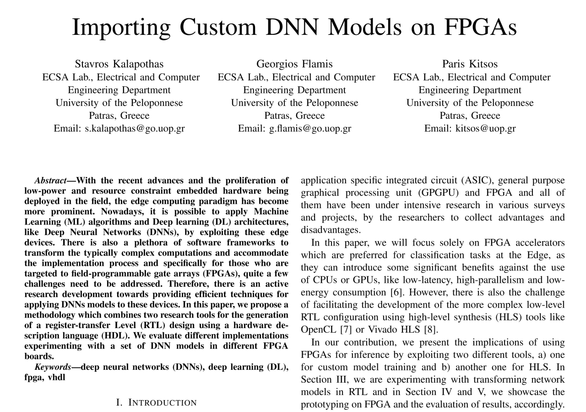

# Importing-Custom-DNN-Models-on-FPGAs
This repo is a placeholder for the related paper presented at the [10th Meditherannean Conference on Embedded Computing (MECO’2021)](http://embeddedcomputing.meconet.me/meco-2021/) and published in [IEEE Xplore](https://ieeexplore.ieee.org/document/9460248).

# Citation
If you use this work in academic research, please, cite it using the following BibTeX:
```
@INPROCEEDINGS{9460248,
  author={Kalapothas, Stavros and Flamis, Georgios and Kitsos, Paris},
  booktitle={2021 10th Mediterranean Conference on Embedded Computing (MECO)}, 
  title={Importing Custom DNN Models on FPGAs}, 
  year={2021},
  volume={},
  number={},
  pages={1-4},
  abstract={With the recent advances and the proliferation of low-power and resource constraint embedded hardware being deployed in the field, the edge computing paradigm has become more prominent. Nowadays, it is possible to apply Machine Learning (ML) algorithms and Deep learning (DL) architectures, like Deep Neural Networks (DNNs), by exploiting these edge devices. There is also a plethora of software frameworks to transform the typically complex computations and accommodate the implementation process and specifically for those who are targeted to field-programmable gate arrays (FPGAs), quite a few challenges need to be addressed. Therefore, there is an active research development towards providing efficient techniques for applying DNNs models to these devices. In this paper, we propose a methodology which combines two research tools for the generation of a register-transfer Level (RTL) design using a hardware description language (HDL). We evaluate different implementations experimenting with a set of DNN models in different FPGA boards.},
  keywords={},
  doi={10.1109/MECO52532.2021.9460248},
  ISSN={2637-9511},
  month={June},
}
```




## Tools used:

* 
* 
* 
* 

## Files

* **LeNet-model.json** (LeNet-5 trained model archtecture with MNIST dataset, export from Tiny-DNN)
* **LeNet-weights.json** (LeNet-5 trained model weights, export from Tiny-DNN)
* **Config_LeNet_custom.txt** (custom generated model config, import to VHDL Generator)
* **Config_LeNet_weights_custom.txt** (custom generated weights file, import to VHDL Generator)
